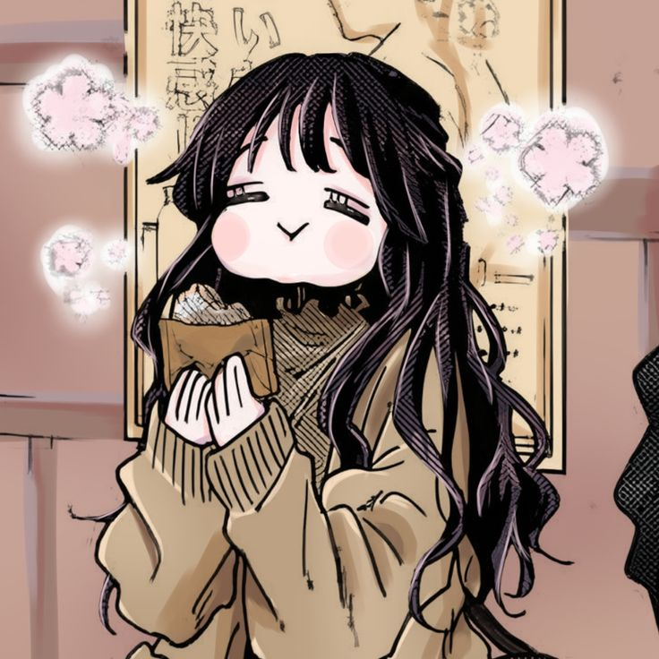
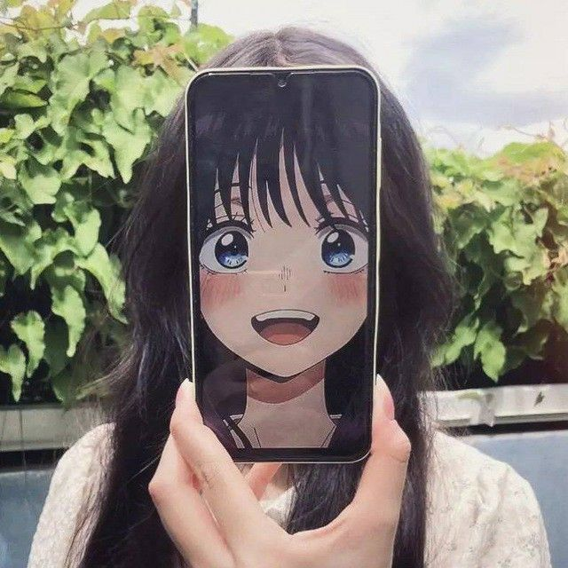

<h1 align="center">
  ⚡ Yo! I'm Rizal ⚡
</h1>

<h3 align="center">💻 Future Cybersecurity | 🌌 Night Coder | 🤖 Machine Learning </h3>

  <i>"Just like anime filler, failures are temporary."</i>

<!-- Divider -->

<!-- About Me Section -->

<h2>😼 About Me</h2>

- 🎯 **Current Focus:** Cybersecurity & Machine Learning
- 🌱 **Learning:** Advanced Python, Network Security, and ML Engineering
- 🎮 **Hobbies:** Coding, Gym, Sleep, Anime
- 💬 **Ask me about:** Python, Linux, Web Security, AI
- ⚡ **Fun fact:** I code better at night (with Reality Club on loop)

---

<!-- Tech Stack Section -->

<h2>🚀 Tech Stack</h2>

### 🤖 AI & Machine Learning

  
  
  
  

### 🔧 Tools & Platforms

  

### 🔒 Cybersecurity Tools

  
  
  
  

---

<!-- GitHub Stats Section -->

<h2>📊 GitHub Stats</h2>

  
  

  

<!-- GitHub Trophy -->

  

---

<h2>📈 Coding Activity</h2>

  

---

<h2>❤️</h2>

  
  
  

---

<!-- Contact Section -->
<h2 align="center">📫 Connect With Me</h2>

  
  
  
  

---

<!-- Footer -->

  

  <i>Thanks for visiting my profile! Have a great day! 😺</i>

